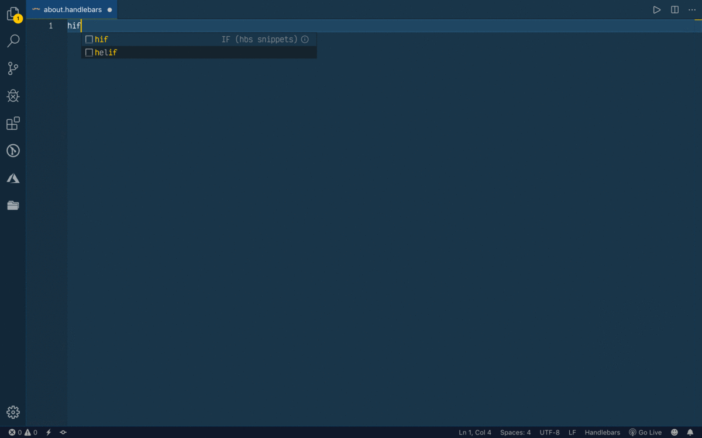

# Handlebars Snippets for Visual Studio Code

---

This extension contains Handlebars snippets for [Vs Code](https://code.visualstudio.com/) editor.

## Installation

In order to install an extension you need to launch the Command Pallete `(Ctrl + Shift + P or Cmd + Shift + P)` and type Extensions.
There you have either the option to show the already installed snippets or install new ones. Search for **hbs-snippets** and install it.

or directly click extension icon which is left side(by default) in your editor

## Supported languages (file extensions)

- Handlebars (.handlebars)
- HBS (.hbs)
- HTML (.html)
- JavaScript (.js)

## Snippets command

Below is a list of all available handlebar snippets and the command of each one. The **⇥** means the `TAB` key.

## Available Methods

|      Prefix | Method                   |
| ----------: | ------------------------ |
|      `hbs→` | `simple hbs syntax`      |
|      `hif→` | `if condition`           |
|    `helif→` | `if else condition`      |
|    `heach→` | `each method`            |
|     `hpar→` | `partial method`         |
|      `hun→` | `unless method`          |
| `hcusfunc→` | `Custom Helper function` |
|     `hlog→` | `Hbs logger helper`      |
|  `hlookup→` | `Hbs lookup helper`      |
|      `hwi→` | `with condition`         |  |

---

Thank you for using this extension.
If you like it then please give me a Rating and If you have little bit of time then please give me a star in Github , Here is repo Link [Ruhan Khandakar](https://github.com/ruhankhandakar/hbs-extension)
